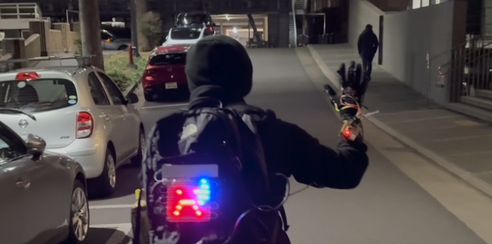

# CycloComm (Cyclist Communicator)

Cyclists often struggle to effectively communicate their intentions or emotions to drivers on the road. The CycloComm bridges this gap by enabling cyclists to express themselves clearly and genuinely, enhancing road safety and harmony. With CycloComm, making specific hand gestures triggers corresponding emojis or messages displayed on an LED screen mounted on the cyclist's back or bag. For instance, a raised hand to apologize can be paired with a crying face emoji, amplifying the sincerity of the gesture. Similarly, a heartfelt “thank you” can be displayed as a cheerful face or a heart, making the message more genuine. This system really amplifies a cyclist's emotions and intentions, enhancing emotional connection and understanding on the road. By allowing cyclists to communicate with drivers more effectively and authentically, CycloComm contributes to a safer, more empathetic driving environment, making every ride a little better for everyone.

---

## File Descriptions

### final_glove_bluetooth_send.ino
This file contains the primary code responsible for capturing hand gesture inputs from the glove’s sensor setup. It processes these gestures and sends corresponding signals to the LED matrix for displaying emojis or messages.

### final_LED_screen_receive.ino
This file focuses on controlling the LED matrix display. It receives the signals from the glove code and translates them into the appropriate visuals, managing brightness, patterns, and text or emoji output.

---

## Assembly and Prototyping

We built everything from scratch: from designing the PCB layout and soldering the electronics to assembling the glove module. The images below showcase the different stages and prototypes, illustrating our hands-on approach to crafting both the hardware and software elements of CycloComm.

1. **Glove Communicator**  
     
   *Our custom-built glove featuring integrated sensors that detect specific hand gestures.*

2. **LED Display Module**  
   
   
   *The LED matrix mounted on a bag or back panel, ready to display emojis, text, or other signals.*

4. **All Prototypes & PCB Design**  
     
   *A showcase of our PCB designs, soldered boards, and fully assembled prototypes that bring the CycloComm concept to life.*
